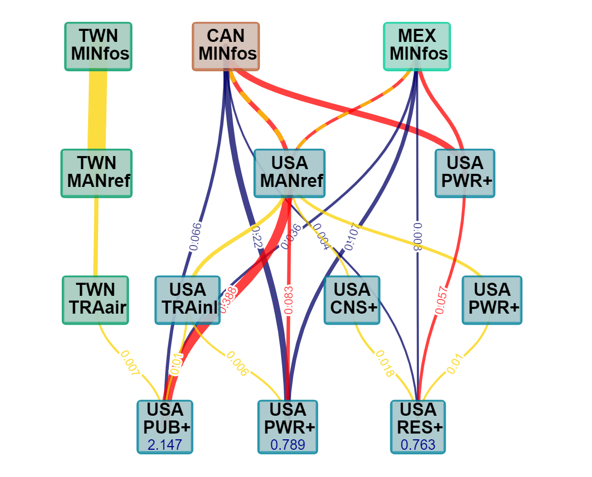

# Capital Stranding Cascades

This repository contains the code and material for: 
__Cahen-Fourot, L., Campiglio, E., Godin, A., Kemp-Benedict, E. and Trsek, S. (2021): "Capital stranding cascades: The impact of decarbonisation on productive asset utilisation"__

All code and data necessary to replicate the the results can be found in the [Main](/Main) folder. 
The __main code file__ is *Cascades_script.R*. It requires the installation of [R](https://cran.r-project.org/).

To run the main code, two additional files are required:
* A library of functions (*Cascades_function_library.R*)
* A version of the World Input-Output Database (WIOD) for the year 2014 (including capital stocks) in which the mining sector has been disaggregated into three separate sectors (*WIOT2014_disaggregated.Rdata*, see [Data](/Data) folder)  

---

The disaggregation of the WIOD mining sector is conducted in separate preparatory code files (see [WIOD_disaggregation](/WIOD_disaggregation) for code and data). However, to run the main code, it is not necessary to run the preparatory code before. 
* The script *ICIO_FossilRatios.R* computes ratios for the splitting of the WIOD mining sector from the OECD Inter-Country Input-Output (ICIO) table. This script requires the sector correspondence sheet *ICIO_to_WIOD.xlsx* as well as the OECD ICIO table for the year 2014. To run the code, please download the ICIO table in csv format from the [OECD website](https://www.oecd.org/sti/ind/inter-country-input-output-tables.htm).
* The script *WIOD_MiningDisaggregation.R* disaggregates the WIOD mining sector using the ratios from ICIO and balances the disaggregated table by means of a two-step RAS algorithm. It requires the raw WIOD table for the year 2014 (*WIOT2014_October16_ROW.RData*), the WIOD capital stock data and exchange rates for the same year (*capital_stocks_wiod.csv* & *exchange_rate_wiod.csv*) as well as the splitting ratios obtained from ICIO (*FossilRatios2014_ICIO.Rdata*).  

## Results

The [Results](/Results) folder contains several tables and figures contained in the paper. Below we show some key figures (see paper for more details).

- __Stranding cascade__ caused by a marginal supply shock in the __global fossil mining sector__ ([download interactive version](/Results/figures/html/Cascades_global_sectors_HTML.html))\
 

- __Stranding caused by domestic fossil sectors__ in other countries (Top 10 countries for external marginal stranding multipliers)  
 

- Main __stranding exposure__ links for the __United States__ 
 

## Contact
For any questions or comments, please write to: emanuele.campiglio@unibo.it
